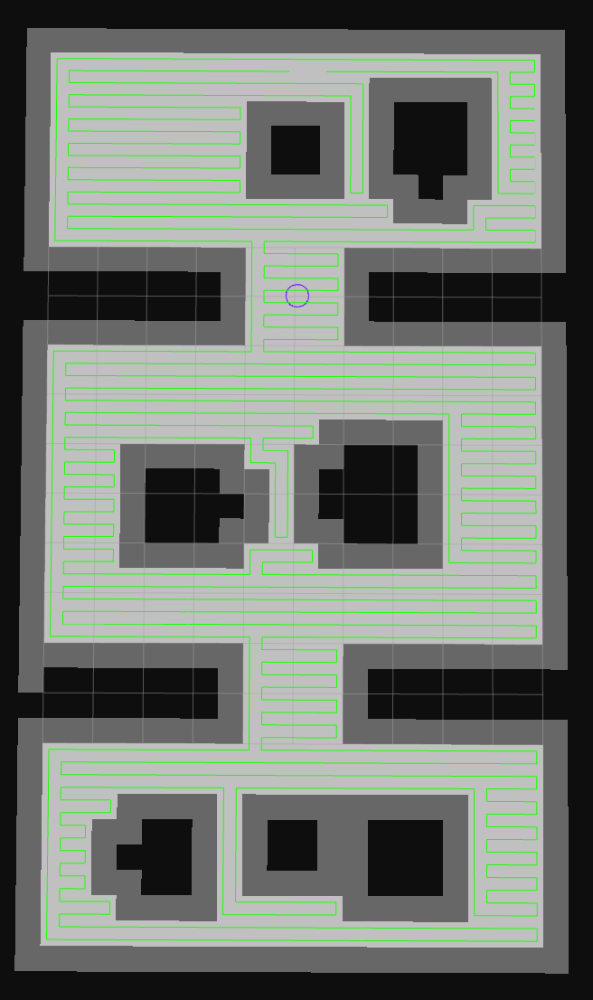
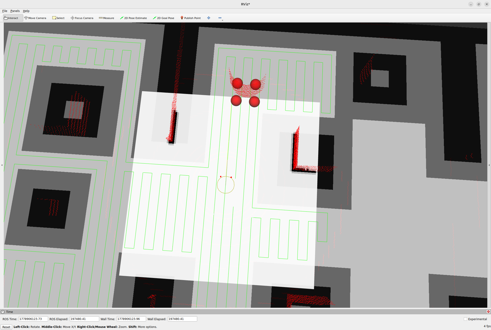

# Swarm-Patrol： Multi-Robot Patrol, Exploration, and Area Coverage

<p align="center">
  <em>A multi-robot system combining Collaborative SLAM, frontier-based exploration, DARP area partitioning, anomaly detection, and Nav2 autonomous navigation.</em>
</p>

---

## Overview

**Swarm-Patrol** integrates several open-source frameworks into a complete multi-robot autonomy stack:

- **[Swarm-SLAM](https://github.com/MISTLab/Swarm-SLAM)** — Sparse Decentralized Collaborative SLAM. Developed at **MISTLab (École Polytechnique de Montréal)** by **Pierre-Yves Lajoie** and **Giovanni Beltrame**. Enables multiple robots to collaboratively build a shared map without a central server, using a novel inter-robot loop closure prioritization (vertex-cover / broker) to minimize communication.
- **[DARP](https://github.com/athakapo/DARP)** — **Divide Areas Algorithm for Robots** by **Athanasios Kapoutsis et al.** (CC BY-NC 4.0). Divides a shared occupancy grid into equal-area or weighted portions among a robot team, with Spanning Tree Coverage (STC) for full-coverage path planning.
- **Nav2** — ROS 2 navigation stack for path planning, collision avoidance, and autonomous navigation.
- **Zenoh** — Efficient inter-DDS routing between robot domains.
- **Frontier Exploration** — Autonomous map discovery when no DARP coverage paths are available.

### Key Features

- **Decentralized SLAM**: No central server; peer-to-peer communication via Zenoh.
- **Multi-robot coordination**: Reservation protocol prevents robots from selecting the same area (frontier navigation).
- **Adaptive exploration**: Switches between frontier-based exploration and DARP coverage path following.
- **Anomaly detection**: Real-time comparison of LiDAR scans against the occupancy grid to detect unexpected obstacles (appearance / disappearance).
- **Heartbeat monitoring**: Detects robot failure and triggers re-division.
- **ROS 2 + Gazebo simulation**: Full simulation stack with configurable worlds and robot counts.

---

## Quick Start (Gazebo Simulation)

### Prerequisites

- ROS 2 Jazzy (or Humble)
- Gazebo (Ignition Fortress or later)
- [Swarm-SLAM dependencies](https://github.com/MISTLab/Swarm-SLAM) (GTSAM 4.2, TEASER++, Zenoh)

### Build

```bash
colcon build --symlink-install
source install/setup.bash
```

### Launch Simulation

**Terminal 1 — Gazebo with 3 robots:**
```bash
ros2 launch diff_drive_robot robot.launch.py robot_count:=3 world:=corridor
```

**Terminal 2 — C-SLAM + Zenoh bridge for each robot:**
```bash
ros2 launch cslam_experiments experiment_lidar.launch.py robot_id:=0 max_nb_robots:=3
# In separate terminals:
ros2 launch cslam_experiments experiment_lidar.launch.py robot_id:=1 max_nb_robots:=3
ros2 launch cslam_experiments experiment_lidar.launch.py robot_id:=2 max_nb_robots:=3
```

**Terminal 3 — Nav2 navigation for each robot:**
```bash
ros2 launch nav_darp robot_nav.launch.py robot_id:=0
# In separate terminals:
ros2 launch nav_darp robot_nav.launch.py robot_id:=1
ros2 launch nav_darp robot_nav.launch.py robot_id:=2
```

**Terminal 4 — Frontier exploration for each robot:**
```bash
ros2 run frontier_exploration exploration_node --ros-args -p robot_id:=0 -p robot_count:=3
# In separate terminals:
ros2 run frontier_exploration exploration_node --ros-args -p robot_id:=1 -p robot_count:=3
ros2 run frontier_exploration exploration_node --ros-args -p robot_id:=2 -p robot_count:=3
```

**Terminal 5 — DARP bridge (one instance per robot domain; broker-enabled only):**
```bash
# Run on the broker robot's domain (e.g., robot 0):
ros2 run darp_areas darp_bridge_node --ros-args -p robot_count:=3
```

**Terminal 6 — Visualization (on domain 100):**
```bash
ROS_DOMAIN_ID=100 ros2 launch cslam_visualization visualization_lidar.launch.py
```

### Real Robots

On real robots, DARP runs **on each robot's own domain** (not domain 100). Only the **broker** robot's DARP instance is active at any given time — it computes the area division and publishes coverage paths for all robots via Zenoh.

---

## Package Reference

### `cslam` — Core Collaborative SLAM

Implements the Sparse Decentralized C-SLAM system. Three main ROS 2 nodes:

- **Loop Closure Detection**: Extracts global descriptors (ScanContext, NetVLAD, CosPlace) from sensor data, shares them with neighbors via a Broker (vertex-cover or simple dialog), and proposes loop closures when matches are found.
- **LiDAR/Stereo/RGBD Handler**: Generates keyframes from sensor streams, downsamples point clouds, performs ICP verification for confirmed loop closures (>25 inliers required by default).
- **Pose Graph Manager** (C++): Maintains a decentralized pose graph using GTSAM. Processes inter-robot and intra-robot loop closures. Runs periodic PGO. Broadcasts optimized TF frames. Configurable optimization periods and strategies.

**Configuration:** `src/cslam/config/cslam/example.yaml`

**Key parameters:** `voxel_size`, `registration_min_inliers`, `max_nb_robots`, `descriptor_technique`, `vertex_cover_selection`

### `cslam_experiments` — Experiment Launchers and Configuration

Launch files and YAML configs for running Swarm-SLAM with various sensors and datasets:

- **Real robots:** Ouster LiDAR, Intel RealSense RGB-D, OAK-D
- **Datasets:** KITTI, KITTI-360, GRACO, S3E, M2DGR, RealRecon
- **Odometry:** RTAB-Map (ICP, visual, RGB-D)
- **Zenoh bridge:** Inter-robot communication via `zenoh-bridge-ros2dds`

**Zenoh allow list** (`config/zenoh/zenoh_cslam.json5`):
```
/cslam/.*, /r.*/tf.*, /r.*/odom, /r.*/pointcloud,
/r.*/cmd_vel, /r.*/darp/.*, /anomaly_detection/.*,
.*/heartbeat_checker/.*, /frontier/.*
```

### `cslam_visualization` — RViz2 Visualization

Online visualization for monitoring SLAM progress on a base station. Subscribes to C-SLAM topics over Zenoh and renders pose graphs, keypoints, and point clouds in RViz2.

**Configuration:** `config/*.rviz` (LiDAR, RealSense, Stereo), `config/*.yaml`

### `frontier_exploration` — Autonomous Frontier-Based Exploration

Maintains a persistent occupancy grid at configurable resolution (default 0.1m / 22×22m). The exploration pipeline:

1. **LiDAR ingestion** → Point cloud transformed to `robot0_map` frame
2. **Grid update** → Ray-traced Bresenham lines mark FREE cells; obstacle endpoints mark OCCUPIED. Floor points also use Bresenham to fill space between robot and floor return as FREE
3. **Frontier detection** → FREE cells adjacent to UNKNOWN cells
4. **Clustering** → Connected components (≥10 cells), with per-cluster clearance check (0.6m margin)
5. **Goal selection** → Closest clear cell in each cluster, clamped to 5.0m
6. **Coordination** → Reservation protocol: `exclusion_radius=3.0m` prevents overlapping goals; penalty scoring biases robots toward unclaimed frontiers
7. **Reachability** → `navigator.getPath()` verifies Nav2 global plan before goal is sent
8. **Monitor loop** → 1Hz check; 120s timeout; on completion → restart exploration timer (5s)

When all frontiers are exhausted, the system notifies the DARP bridge to trigger area coverage.

| Parameter | Default | Description |
|-----------|---------|-------------|
| `grid_resolution` | 0.1 | Grid cell size (m) |
| `grid_width` / `grid_height` | 22.0 / 22.0 | Grid dimensions (m) |
| `sensor_range` | 3.0 | LiDAR integration radius (m) |
| `exploration_period` | 5.0 | Timer interval for exploration cycle (s) |
| `frontier_timeout` | 120.0 | Per-goal timeout (s) |
| `dispersion_threshold` | 4.0 | Coordinator penalty zone radius (m) |
| `coordination_exclusion_radius` | 3.0 | Reservation exclusion radius (m) |

### `darp_areas` — DARP Area Division and Coverage Path

ROS 2 bridge wrapping the DARP algorithm. On real robots it runs in each robot's domain; only the broker's instance is active at a time. Receives the merged occupancy grid via `WakeUp` message, builds a raster grid, runs DARP to divide the area among robots, and publishes `nav_msgs/Path` coverage routes.

**Process:**
1. Receives `WakeUp` with target resolution, obstacle dilation, padding
2. Downsamples frontier grid to DARP resolution (0.5m default) via `cv2.INTER_AREA`
3. Applies obstacle dilation (`cv2.dilate`, configurable kernel size)
4. Applies padding cells (100 = occupied border)
5. Extracts largest FREE connected component (accessible area)
6. Runs DARP algorithm (doubled grid + STC) on the assigned portion
7. Publishes `/{ns}/darp/route` and `/{ns}/darp/area_markers`

| Parameter | Default | Description |
|-----------|---------|-------------|
| `robot_count` | 1 | Number of robots in the team |
| `robot_prefix` | r | Robot topic prefix |
| `default_frame_id` | robot0_map | Shared coordinate frame |
| `default_padding` | 1.0 | Grid padding (m) |
| `default_obstacle_dilation` | 1 | Obstacle dilation cells |
| `expected_width` / `expected_height` | 220 / 220 | Expected DARP grid dimensions (cells) |

<div align="center">
  
  <p><em>Rviz visualization: DARP coverage paths over the shared occupancy grid with obstacle dilation</em></p>
</div>

### `nav_darp` — Nav2 Navigation Stack

Full Nav2 bringup for each robot, including:

- **Nav2 nodes:** controller_server, planner_server, smoother_server, behavior_server, BT navigator, lifecycle manager
- **Costmaps:** Rolling-window local costmap + static global costmap
- **BT Navigator:** Follows DARP coverage paths (`follow_path.xml`) or navigates to frontier goals (`navigate_to_pose.xml`)
- **DARP Path Follower:** Subscribes to `/{ns}/darp/route` and publishes goals sequentially
- **Odom-to-Map Publisher:** Listens for C-SLAM `PoseGraph` messages and publishes `robot{X}_map → r{X}/odom` TF
- **Realtime Point Cloud:** Transforms `r{X}/laser_frame` → `r{X}/pointcloud_real` for Nav2 sensor input
- **Nav2 Parameters:** Per-robot configs (`nav2_params_r0.yaml`, `nav2_params_r1.yaml`, `nav2_params_r2.yaml`)

### `diff_drive_robot` — Gazebo Simulation

Launches N differential-drive robots in a simulated world. Each robot has:

- **Chassis:** 0.3×0.3×0.15m purple box
- **Wheels:** 0.05m radius cylinders
- **LiDAR:** 16-beam GPU ray, 30m range, 1800×16 resolution, 10Hz, `gpu_ray` type
- **DiffDrive plugin:** Wheel separation 0.35m
- **OdometryPublisher:** 50Hz, publishes `r{X}/odom` and TF

| World | Description |
|-------|-------------|
| `corridor.world` | Double square (20×20m outer, 10×10m inner) with central pillar and missing inner wall opening |
| `two_rooms.world` | Two connected rooms separated by a wall with a door opening |
| `world_pillar_forest.world` | Concentric pillar rings with L-shaped obstacles and narrow corridor segments (simulates a forest or urban canyon) |

### `heartbeat_checker` — Robot Health Monitoring

- Each robot publishes a periodic heartbeat on `{ns}/heartbeat`
- A cross-domain checker subscribes to all robots' heartbeats
- If a robot's heartbeat stops (configurable timeout), a `LostRobots` message is published
- DARP can re-divide the area on robot loss

### `anomaly_detection` — Real-Time Obstacle Detection

- Subscribes to LiDAR point clouds and occupancy grid
- For each LiDAR point: checks if the grid cell was previously FREE → marks as **appearance anomaly**
- For each ray: checks if cells along the beam were OCCUPIED → marks as **disappearance anomaly**
- Publishes `AnomalyDetected` messages with pose and type
- Exploration node reacts by:
  1. Setting an `anomaly_mask` (prevents re-selecting the area)
  2. Clearing affected cells to UNKNOWN (re-exploration)
  3. Publishing `anomaly_cleared` when all frontiers are exhausted

<div align="center">
  
  <p><em>Rviz visualization: anomaly appearance hit — new obstacle detected where the grid previously showed free space</em></p>
</div>

---

## Communication / Zenoh Bridge

Each robot runs on its own `ROS_DOMAIN_ID`. Zenoh bridges route specific topics between domains:

**Bridge config** (`config/zenoh/zenoh_cslam.json5`):
```json5
allow: {
  publishers: [
    "/cslam/.*", "/r.*/tf.*", "/r.*/odom", "/r.*/pointcloud",
    "/r.*/cmd_vel", "/r.*/darp/.*", "/anomaly_detection/.*",
    ".*/heartbeat_checker/.*", "/frontier/.*"
  ],
  subscribers: [ /* same list */ ]
}
```

The visualization node runs on domain 100 with its own Zenoh bridge.

---

## Configuration

### CSLAM Parameters (`config/ouster_lidar.yaml`)

| Parameter | Value |
|-----------|-------|
| `sensor_type` | lidar |
| `voxel_size` | 0.3 |
| `registration_min_inliers` | 25 |
| `descriptor_technique` | scancontext / netvlad / cosplace |
| `vertex_cover_selection` | true |
| `enable_broadcast_tf_frames` | true |

### DARP Bridge Parameters

| Parameter | Default | Description |
|-----------|---------|-------------|
| `robot_count` | 1 | Number of robots |
| `frame_id` | robot0_map | Shared frame |
| `padding` | 1.0 | Grid padding (m) |
| `obstacle_dilation` | 1 | Dilation cells |
| `expected_width/height` | 220 | DARP grid cells |

### Exploration Parameters

| Parameter | Default | Description |
|-----------|---------|-------------|
| `sensor_range` | 3.0 | LiDAR integration radius (m) |
| `grid_resolution` | 0.1 | Grid cell size (m) |
| `grid_width/grid_height` | 22.0 | Grid dimensions (m) |
| `exploration_period` | 5.0s | Exploration timer (s) |
| `frontier_timeout` | 120.0s | Per-goal timeout (s) |

### Nav2 Parameters (`nav2_params_rX.yaml`)

Per-robot costmap configurations. `global_frame: robot{X}_map`. Behavior tree selection (follow_path vs navigate_to_pose).

---

## Third-Party Licenses

| Component | License | Copyright |
|-----------|---------|-----------|
| Swarm-SLAM core (`cslam`, `cslam_common_interfaces`, `cslam_experiments`) | MIT | 2022 Pierre-Yves Lajoie |
| `cslam_visualization` | BSD | Pierre-Yves Lajoie |
| DARP algorithm (`darp_areas/src/lib/`) | CC BY-NC 4.0 | Athanasios Kapoutsis et al. |
| `darp_areas` (ROS 2 wrapper) | MIT | — |
| `frontier_exploration` | MIT | — |
| `heartbeat_checker` | MIT | — |
| `anomaly_detection` | MIT | — |
| `nav_darp` | Apache 2.0 | — |

---

## Credits

- **Pierre-Yves Lajoie** — Primary author of Swarm-SLAM core (C-SLAM, experiments, visualization)
- **Giovanni Beltrame** — Co-author, MISTLab director
- **Athanasios Kapoutsis et al.** — Original DARP algorithm
- **MISTLab** (École Polytechnique de Montréal) — Research lab behind Swarm-SLAM

### Publications

- P.-Y. Lajoie, B. Ramtoula, Y. Chang, L. Carlone, and G. Beltrame, "DOOR-SLAM: Distributed, Online, and Outlier Resilient SLAM for Robotic Teams," *IEEE Robotics and Automation Letters*, 2020.
- P.-Y. Lajoie and G. Beltrame, "Swarm-SLAM: Sparse Decentralized Collaborative Simultaneous Localization and Mapping Framework for Multi-Robot Systems," *arXiv preprint arXiv:2301.06230*, 2023.
- A. Kapoutsis, S. Chatzichristofis, and E. Kosmatopoulos, "DARP: Divide Areas Algorithm for Optimal Multi-Robot Coverage," *Journal of Intelligent & Robotic Systems*, 2017.

---

## Project Structure

```
Swarm-Patrol/
├── src/
│   ├── cslam/                          # Core C-SLAM (submodule)
│   │   ├── cslam/                      # Python nodes
│   │   └── cslam_core/                 # C++ pose graph manager
│   ├── cslam_common_interfaces/        # 23 custom ROS 2 message types
│   ├── cslam_experiments/              # Launch files, configs, datasets
│   │   ├── config/                     # Experiment YAML + Zenoh JSON5
│   │   ├── launch/                     # Robot & dataset experiment launchers
│   │   └── docker/                     # Dockerfile + makefile
│   ├── cslam_visualization/            # RViz2 visualization node
│   ├── darp_areas/                     # DARP bridge node
│   │   ├── darp_bridge_node.py         # ROS 2 wrapper
│   │   └── src/                        # DARP algorithm implementation
│   ├── diff_drive_robot/               # Gazebo simulation
│   │   ├── urdf/                       # XACRO robot model
│   │   ├── worlds/                     # Simulation worlds
│   │   ├── launch/                     # Robot spawner
│   │   └── config/                     # Gazebo bridge config
│   ├── frontier_exploration/           # Autonomous exploration
│   │   ├── frontier_exploration/       # Python nodes
│   │   │   ├── exploration_node.py     # Main exploration node
│   │   │   ├── frontier_finder.py      # Frontier detection & clustering
│   │   │   └── coordinator.py          # Multi-robot coordination
│   │   └── launch/                     # Launch files
│   ├── heartbeat_checker/              # Robot health monitoring
│   ├── nav_darp/                       # Nav2 integration
│   │   ├── launch/                     # Nav2 per-robot launcher
│   │   ├── config/                     # Nav2 params YAML
│   │   └── behavior_trees/             # Follow path BT
│   └── anomaly_detection/              # Real-time obstacle detection
├── gtsam/                              # GTSAM library (built from source)
├── media/                              # Screenshots and media
│   ├── path.png                        # DARP coverage paths + grid
│   └── appearance_hit.png              # Anomaly appearance detection
└── README_en.md                        # This file
└── README.md                           # Russian version (русский) 
```

## Docker

Pre-built Docker environment for LiDAR-based experiments:

```bash
cd src/cslam_experiments/docker
make build       # Build image
make cpu_run     # Start container
make attach      # Shell into container
```

Inside the container:
```bash
make swarmslam-lidar ROBOT_ID=0   # Launch robot 0 C-SLAM + Zenoh
make viz                           # Launch RViz2 on domain 100
```
